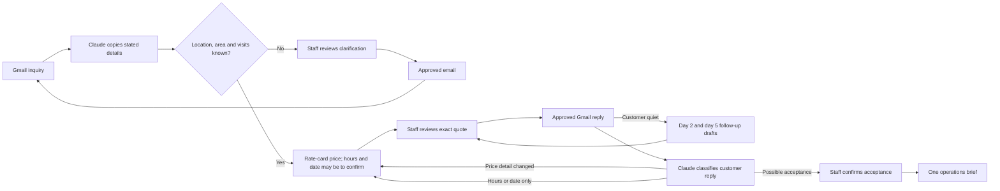

# AI Inquiry-to-Quote

A portable n8n workflow package that turns a Gmail inquiry into a reviewed cleaning
quote, nudges quiet customers with approved follow-ups, and creates an operations
brief after staff confirms acceptance. Claude interprets messages; database rules
control prices, approvals, state changes, and delivery claims.

This is a fictional recurring office-cleaning business using synthetic customer data
and demonstration PHP pricing. It is a portfolio project, not a deployed cleaning
service or a market pricing recommendation.

## Status

The current 61-node package is **OFFLINE_VERIFIED** and
**OFFLINE_RUNTIME_VERIFIED**. On 30 September 2026 its 71 deterministic tests passed,
26 workflow runs were repeated in isolated n8n with simulated providers, and the
canonical exports were imported and round-tripped; the canvas was inspected on
28 September, and the layout has not changed since. See the
completed checks and their boundaries in [the test report](evidence/TEST_REPORT.md).
All exported workflows are **inactive** and contain no account credentials.

**LIVE_VERIFIED (29 September 2026):** all 8 scenarios in
[the live test runbook](docs/LIVE_TEST.md) passed on real Gmail, Claude Haiku 4.5 and
hosted Supabase with SSL certificate verification. See
[the live test record](evidence/live-test.json). Eight scenarios show the paths work
end to end; they do not measure extraction accuracy across many emails.

**Still NOT_LIVE_TESTED:**

- clarification drafts
- staff notification emails
- uncertain-send reconciliation
- error-workflow dispatch
- quote and approval expiry
- staff detail corrections

A private build (`npm run build:private`) and the runbook are ready to repeat the test
with the operator's accounts.

## What it does



| Export | Responsibility | Default schedule |
|---|---|---|
| `01-gmail-intake.json` | Gmail intake, Claude analysis, explicitly requested analysis retries | Inbox every minute; requested retries every two minutes |
| `02-quote-preparation.json` | Prepare clarification, quote and follow-up drafts | Every minute |
| `03-review-and-delivery.json` | Authenticated staff portal and approved sending | Portal on request; delivery check every minute |
| `04-maintenance.json` | Deadlines, exceptions, optional staff digests | Every fifteen minutes and workflow error events |

Shared state lives in a dedicated PostgreSQL schema in Supabase. The inbox is scoped
to an `ITQ` Gmail label. Customer sending and staff notifications are disabled in the
default configuration as well as all four workflows being inactive.

### AI and deterministic work

| Claude handles | Rules and staff handle |
|---|---|
| Copy stated requirements, and the customer's own start-date words, with supporting text | Validate fields, turn start-date words into a date, detect missing details |
| Classify questions, revisions, and possible acceptance | Calculate PHP prices from a versioned rate card |
| Restate the request in one or two plain sentences | Fixed email wording, follow-up template, and approval of the exact recipient and message |
| Summarize an inquiry | Confirm acceptance and create the job record |

Customer messages are data. A request inside an email to ignore approval rules or
change prices cannot grant authority to the model.

### Reliability built into the process

- Gmail message identity prevents repeated intake from creating repeated inquiries.
- A quote needs only location, floor area and visits per week; missing hours or a
  start date are asked for alongside it instead of holding it back.
- Code, not Claude, works out dates such as "next Monday", repeats the customer's
  words in the quote, and leaves vague wording such as "ASAP" to be confirmed.
- Quotes preserve the scope and rate-card version used to calculate them.
- Only a price-detail change cancels a sent quote; hours or a date sent later give an
  updated quote at the same price.
- Approval applies to one exact outgoing message and its current source revision.
- Follow-ups use a fixed template, need approval, and stop when the customer replies,
  the quote expires, or staff reject one.
- Delivery uncertainty remains visible for staff reconciliation before another send.
- Possible customer acceptance requires staff confirmation before handoff.
- Audit events record the important changes and decisions.

## Where it fits

It removes the copying, arithmetic and typing around a quote, and it keeps quotes
from being forgotten. It does not remove decisions: a person approves every
outgoing email and every acceptance, which is the right default for a first
deployment but limits the time saved. Many commercial cleaning jobs are priced after
a site visit, so a real business would likely use this for standard recurring jobs
or pair it with visit booking. See [the case study](docs/CASE_STUDY.md).

## Start here

1. Read [Setup](docs/SETUP.md) to connect a private n8n copy when ready.
2. Read [Operations](docs/OPERATIONS.md) for approval, follow-up, recovery, and
   handoff procedures.
3. Use [the offline demo](docs/DEMO.md) to present synthetic examples honestly.
4. Read [the database contract](docs/DATABASE.md) before changing business rules.
5. Use [the live test runbook](docs/LIVE_TEST.md) for the controlled account test.

`npm run package` writes a scanned portable archive to `dist/inquiry-to-quote.zip`. The saved
[review board](evidence/demo-review.html) and [handoff board](evidence/demo-handoff.html)
demonstrate the interface with synthetic records; they are not the connected staff
portal.

To reproduce the local checks, install Node.js 22.22 or later, then run these commands
from this product directory:

```powershell
npm ci
npm run build
npm test
npm run demo
```

These package commands do not connect Gmail, call Claude, or apply a Supabase schema.
The development dependencies include PGlite for local PostgreSQL execution, its
socket adapter for runtime verification, and fflate for creating the portable ZIP.
n8n runs the imported workflow nodes; Node.js is needed for the package's build and
verification tools.

`npm run verify` combines the build and test commands. After verification,
`npm run package` regenerates the archive and validates its contents. See
[evidence/runtime-verification.json](evidence/runtime-verification.json) for the
recorded n8n checks; the command above does not silently repeat them.

To repeat the isolated n8n checks with n8n 2.27.4 already installed:

```powershell
node tools/runtime_verify.mjs
node tools/runtime_verify.mjs --recovery
```

Run these sequentially with ports 5890–5893 available. Each command creates a
private `.runtime/` directory, imports synthetic local credentials, and runs actual
Code, IF, HTTP and Postgres nodes. Gmail operations are replaced by loopback HTTP
fixtures; triggers receive synthetic inputs. Set `N8N_CLI_PATH` to the installed
n8n JavaScript entry point if it is not under the Windows npm installation path.
These commands do not install n8n or connect your provider accounts. The recovery
suite writes `evidence/runtime-recovery.json` separately from the main suite.

## Package map

| Path | Contents |
|---|---|
| `workflows/` | Four inactive n8n exports |
| `src/` | Message normalization, Claude validation, start-date reading, and staff portal code |
| `config/settings.json` | Business name, model, URLs, inbox scope, follow-up timing, and disabled sending switches |
| `config/settings.local.example.json` | Template for the gitignored private live-test settings |
| `db/` | Schema, transactional API, and sample pricing |
| `fixtures/` | Synthetic email/model examples |
| `tests/` | Offline behavior and structure checks |
| `tools/` | Build (canonical and private), demo, packaging, runtime checks, and the layout registry |
| `evidence/` | Test results and sanitized verification evidence |
| `docs/` | Setup, operations, demo, live test, and case study |

The canonical layouts use a 208-pixel step on the seven-dot grid. The product-local
registry in `tools/workflow_layouts.json` maps every node; verification checks layout
coverage and collisions alongside workflow structure.

## Version-one boundaries

One inbox, one service, one staff reviewer, PHP, email text, and a recorded operations
handoff. Requested dates are preferences until availability is confirmed. Creating an
operations brief does not schedule a crew or guarantee that work can begin.

Payments, invoices, attachment extraction, Messenger, crew scheduling, site-visit
booking and a customer portal are outside this release. Follow-ups are drafted for
staff approval; nothing is sent to a customer without review.

The portal supports approval/rejection, staff requirement corrections, explicit
analysis retry or manual recovery, delivery reconciliation, confirmed rejection, and
confirmed acceptance. Financial terms remain fixed by the rate card and quote
template. Initial inbox polling does not automatically backfill old email.

The [case study](docs/CASE_STUDY.md) separates implemented behavior from future business
measurements. No revenue, time-saving, or production reliability claims are inferred
from synthetic tests.
